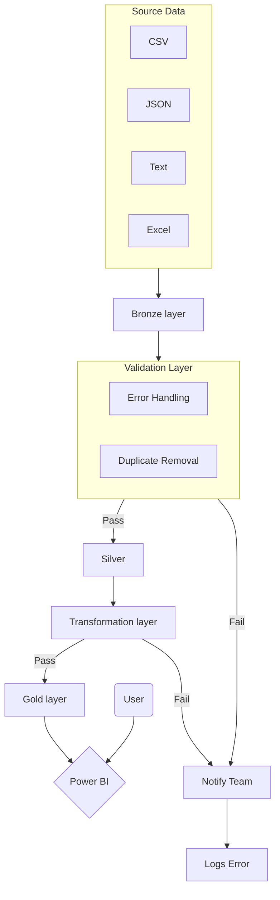

# Pipeline Architecture Diagram

```mermaid
flowchart TD
    Source --> Bronze[Bronze layer]
    Bronze --> Validation
    Validation -->|Pass| Silver
    Validation -->|Fail| Alert[Notify Team]
    Alert --> Report[Logs Error]
    Silver --> Transform[Transformation layer]
    Transform -->|Pass| Gold[Gold layer]
    Transform --->|Fail| Alert
    Gold --> PowerBI{Power BI}
    User(User) --> PowerBI
    
    subgraph Source[Source Data]
        CSV
        JSON
        Text
        Excel
    end
    
    subgraph Validation[Validation Layer]
        ErrorHandling[Error Handling]
        DuplicateRemoval[Duplicate Removal]
    end
```
